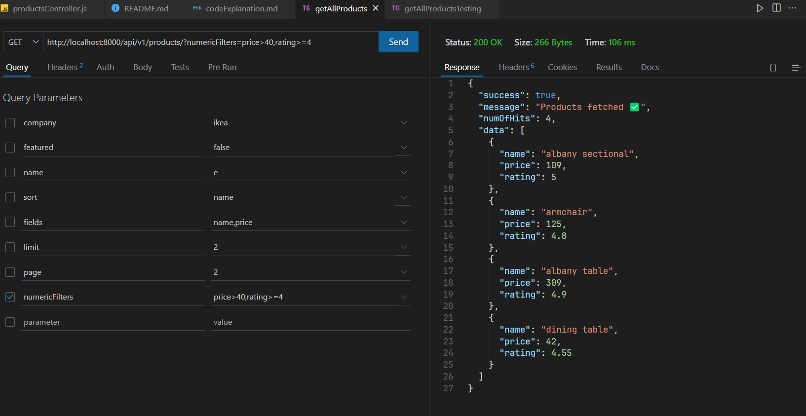

```js
export async function getAllProducts(req, res) {
  const { featured, company, name, sort, fields, numericFilters } = req.query; //we set this up
  const queryObj = {};
  if (featured) {
    queryObj.featured = featured === "true" ? true : false;
  }

  if (company) {
    queryObj.company = company;
  }

  if (name) {
    queryObj.name = {
      $regex: name,
      $options: "i",
    };
  }

  if (numericFilters) {
    const operatorMap = {
      ">": "$gt",
      "<": "$lt",
      ">=": "$gte",
      "<=": "$lte",
      "=": "$eq",
    };

    const regEx = /\b(<|>|>=|=|<|<=)\b/g; // from stackOverflow
    let filters = numericFilters.replace(
      regEx,
      (match) => `-${operatorMap[match]}-`
    );

    const options = ["price", "rating"];
    filters = filters.split(",").forEach((item) => {
      const [field, operator, value] = item.split("-");
      if (options.includes(field)) {
        queryObj[field] = { [operator]: Number(value) };
      }
    });
  }

  console.log(queryObj); // { price: { '$gt': 40 }, rating: { '$gte': 4 } }
  let result = ProductModel.find(queryObj);
  if (sort) {
    const sortedList = sort.split(",").join(" ");
    result = result.sort(sortedList);
  } else {
    result = result.sort("createdAt");
  }

  if (fields) {
    const fieldsToInclude = fields.split(",").join(" ");
    result = result.select(fieldsToInclude);
  }

  const page = parseInt(req.query.page) || 1; //req.query => initially a string.
  const limit = parseInt(req.query.limit) || 10;
  const skip = (page - 1) * limit;

  result = result.skip(skip).limit(limit).select("name price rating -_id"); //! 23 / 7 = 7 7 7 2

  const products = await result;
  res.status(200).json({
    success: true,
    message: "Products fetched ✅",
    numOfHits: products.length,
    data: products,
  });
}
```


### **Code Explanation👨🏻‍💻**
Let’s break the `getAllProducts` function into easy-to-understand steps. This function fetches products from our database based on the filters provided by the user in the request. We’ll go through it step-by-step and see how everything works.

---

### **1. Extracting Query Parameters**

```javascript
const { featured, company, name, sort, fields, numericFilters } = req.query;
const queryObj = {};
```

- `req.query` contains all the query parameters in the URL.
  - Example: If the URL is `/api/products?featured=true&sort=price`, then `req.query` will have `{ featured: "true", sort: "price" }`.
- We are extracting specific filters (`featured`, `company`, `name`, etc.) that the user may provide.
- `queryObj` is an empty object where we will store the filter conditions for the database.

---

### **2. Filtering Products Based on User Input**

**a) Filter by `featured`:**

```javascript
if (featured) {
  queryObj.featured = featured === "true" ? true : false;
}
```

- If the user provides `featured=true`, this will add `{ featured: true }` to `queryObj`.
- This means we are only looking for products that are marked as `featured` in the database.

---

**b) Filter by `company`:**

```javascript
if (company) {
  queryObj.company = company;
}
```

- If the user specifies `company=Apple`, we add `{ company: "Apple" }` to `queryObj`.

---

**c) Filter by `name`:**

```javascript
if (name) {
  queryObj.name = {
    $regex: name,
    $options: "i",
  };
}
```

- This is a case-insensitive search. For example, if `name=phone`, it will find all products with "phone" in their name (e.g., "Smartphone", "iPhone").

---

### **3. Handling Numeric Filters (e.g., price > 40)**

```javascript
if (numericFilters) {
  const operatorMap = {
    ">": "$gt",
    "<": "$lt",
    ">=": "$gte",
    "<=": "$lte",
    "=": "$eq",
  };

  const regEx = /\b(<|>|>=|=|<|<=)\b/g;
  let filters = numericFilters.replace(
    regEx,
    (match) => `-${operatorMap[match]}-`
  );

  const options = ["price", "rating"];
  filters = filters.split(",").forEach((item) => {
    const [field, operator, value] = item.split("-");
    if (options.includes(field)) {
      queryObj[field] = { [operator]: Number(value) };
    }
  });
}
```

- This part processes filters like `price>30` or `rating>=4`.
- `numericFilters` are converted into MongoDB-style filters.
  - Example: `price>30` becomes `{ price: { $gt: 30 } }`.
- If multiple filters are given (e.g., `price>30,rating>=4`), both are added to `queryObj`.

---

### **4. Building the Database Query**

```javascript
let result = ProductModel.find(queryObj);
```

- `ProductModel.find(queryObj)` means we are searching for all products that match the filters stored in `queryObj`.

---

### **5. Sorting**

```javascript
if (sort) {
  const sortedList = sort.split(",").join(" ");
  result = result.sort(sortedList);
} else {
  result = result.sort("createdAt");
}
```

- If the user provides `sort=price,rating`, we sort the results by `price` first and then `rating`.
- If no sort option is provided, we sort by `createdAt` (the date the product was added).

---

### **6. Selecting Specific Fields**

```javascript
if (fields) {
  const fieldsToInclude = fields.split(",").join(" ");
  result = result.select(fieldsToInclude);
}
```

- If the user provides `fields=name,price`, we only fetch the `name` and `price` fields for each product.

---

### **7. Pagination**

```javascript
const page = parseInt(req.query.page) || 1;
const limit = parseInt(req.query.limit) || 10;
const skip = (page - 1) * limit;

result = result.skip(skip).limit(limit).select("name price rating -_id");
```

- **`page`**: Which page of results to show. Defaults to 1.
- **`limit`**: How many products to show per page. Defaults to 10.
- **`skip`**: Skips the appropriate number of products to get the correct page.

  - Example: On `page=2` with `limit=10`, `skip = (2 - 1) * 10 = 10`. This skips the first 10 products.

---

### **8. Executing the Query**

```javascript
const products = await result;
```

- This actually runs the query and fetches the products from the database.

---

### **9. Sending the Response**

```javascript
res.status(200).json({
  success: true,
  message: "Products fetched ✅",
  numOfHits: products.length,
  data: products,
});
```

- We send back a JSON response containing the list of products and the number of hits.

---

### **Summary**

The `getAllProducts` controller does the following:
1. Extracts filters from the request query.
2. Builds a MongoDB query object (`queryObj`) based on the filters.
3. Adds sorting, field selection, and pagination to the query.
4. Fetches the products from the database.
5. Sends the list of products in the response.

---
